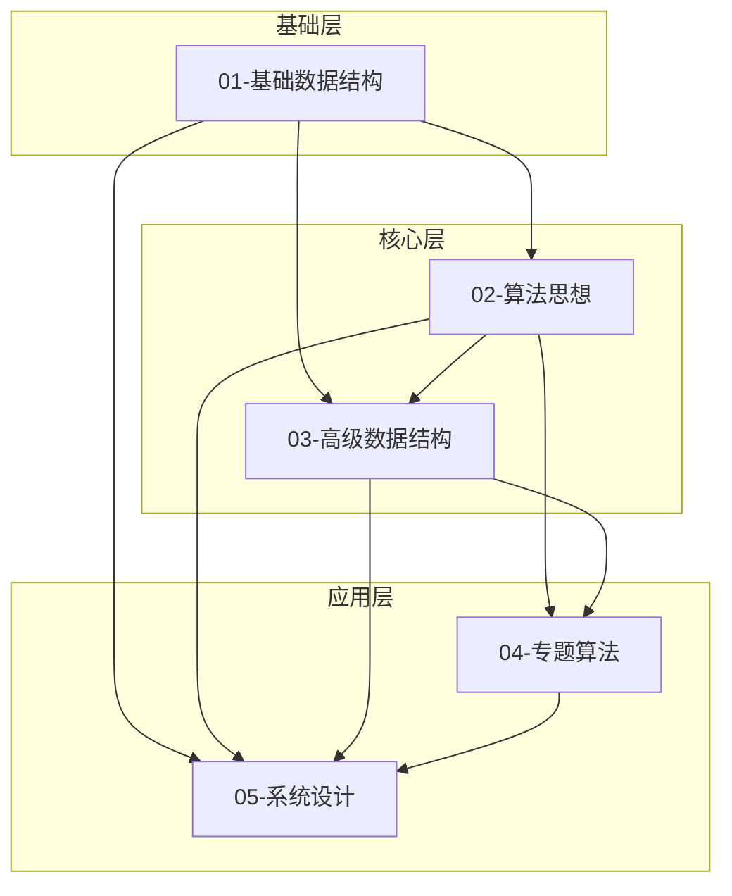

# 算法知识库分类关系链

## 🔗 整体关系图



## 📊 详细关系分析

### 第一层：基础数据结构（地基）
```
01-基础数据结构
├── 数组与矩阵      ← 最基础，所有算法的载体
├── 字符串处理      ← 基于数组，特殊的数据处理
├── 链表操作        ← 动态结构，指针操作基础
├── 栈与队列        ← 基于数组/链表的抽象结构
├── 哈希表应用      ← 查找优化的基础
└── 基础树结构      ← 递归结构的入门
```

**作用：** 提供数据存储和基本操作的载体

### 第二层：算法思想（核心引擎）
```
02-算法思想
├── 双指针技巧      ← 基于数组/链表操作
├── 滑动窗口        ← 基于双指针 + 哈希表
├── 递归与分治      ← 基于树结构思维
├── 动态规划        ← 基于递归优化
├── 贪心算法        ← 基于问题特性分析
├── 回溯算法        ← 基于递归 + 状态回退
├── DFS/BFS         ← 基于栈/队列 + 图遍历
└── 二分查找        ← 基于有序数组特性
```

**作用：** 提供解决问题的思维方法和策略

### 第三层：高级数据结构（性能优化）
```
03-高级数据结构
├── 堆与优先队列    ← 基于数组 + 特殊排序
├── 二叉搜索树      ← 基于树 + 二分思想
├── 平衡树          ← 基于BST + 平衡策略
├── 图论基础        ← 基于数组/链表表示
├── 并查集          ← 基于数组 + 路径压缩
├── 字典树Trie      ← 基于树 + 字符串处理
├── 线段树          ← 基于数组 + 分治思想
└── 跳表            ← 基于链表 + 概率算法
```

**作用：** 提供特定场景下的高效解决方案

### 第四层：专题算法（领域应用）
```
04-专题算法
├── 排序算法        ← 综合多种基础结构和思想
├── 字符串算法      ← 基于字符串 + 多种算法思想
├── 数学算法        ← 基于数学原理 + 编程实现
├── 位运算          ← 基于二进制 + 位操作技巧
├── 几何算法        ← 基于数学 + 空间处理
└── 网络流          ← 基于图 + 特殊算法
```

**作用：** 解决特定领域的复杂问题

### 第五层：系统设计（工程实践）
```
05-系统设计
├── LRU缓存         ← 链表 + 哈希表 + 系统需求
├── 一致性哈希      ← 哈希表 + 分布式理论
├── 限流算法        ← 队列 + 时间窗口算法
└── 分布式算法      ← 多种数据结构 + 网络通信
```

**作用：** 将算法知识应用到实际系统中

## 🔄 相互依赖关系

### 向上依赖（必须掌握的前置知识）

```
系统设计 ← 专题算法 ← 高级数据结构 ← 算法思想 ← 基础数据结构
```

### 横向关联（同层互补）

**基础数据结构内部：**
- 数组 ↔ 字符串（字符串本质是字符数组）
- 数组 ↔ 栈/队列（实现基础）
- 链表 ↔ 树（都是指针结构）

**算法思想内部：**
- 递归 ↔ 动态规划（优化关系）
- DFS ↔ 回溯（实现方式）
- 双指针 ↔ 滑动窗口（特殊应用）

**高级数据结构内部：**
- 堆 ↔ 优先队列（抽象与实现）
- BST ↔ 平衡树（优化关系）
- 图 ↔ 树（特殊与一般）

## 🎯 学习路径建议

### 线性学习路径（适合新手）
```
1. 基础数据结构 (2-3周)
   数组 → 链表 → 栈队列 → 哈希表 → 基础树

2. 核心算法思想 (4-6周)
   双指针 → 递归 → DFS/BFS → 二分 → 动态规划 → 贪心

3. 高级数据结构 (3-4周)
   堆 → BST → 图 → 并查集 → Trie

4. 专题算法 (3-4周)
   排序 → 字符串 → 数学 → 位运算

5. 系统设计 (2-3周)
   缓存 → 限流 → 分布式
```

### 螺旋式学习路径（适合有基础）

#### 第一轮：掌握基础 (2-3周)
**目标**: 建立知识框架，快速概览全貌
```
基础数据结构层:
├── 数组双指针 (1周) - 移动零、两数之和
├── 链表基础 (1周) - 反转链表、环检测
└── 栈队列 (3天) - 括号匹配、层序遍历

算法思想层:
├── 递归入门 (2天) - 斐波那契、阶乘
├── DFS模板 (2天) - 二叉树遍历
└── BFS模板 (2天) - 层序遍历、最短路径

高级结构层:
├── 堆基础 (2天) - 堆排序、TopK
└── 图基础 (3天) - 图的表示、基本遍历
```

#### 第二轮：深入核心 (4-5周)
**目标**: 重点突破算法思想，建立解题思维
```
双指针专精 (1周):
├── 快慢指针 → 环检测、找中点、删除倒数第N个
├── 对撞指针 → 两数之和、三数之和、盛水容器
├── 滑动窗口 → 最长无重复子串、最小覆盖子串
└── 综合应用 → 长度最小子数组、水果成篮

动态规划深入 (2周):
├── 基础DP → 爬楼梯、最大子数组、打家劫舍
├── 背包问题 → 01背包、完全背包、多重背包
├── 路径问题 → 路径总数、最小路径和、三角形
└── 序列DP → LIS、LCS、编辑距离

搜索算法强化 (1.5周):
├── DFS深化 → 全排列、组合、子集、N皇后
├── BFS优化 → 双向BFS、A*搜索
├── 回溯剪枝 → 数独、单词搜索、分割回文串
└── 记忆化搜索 → 递归+缓存优化

二分查找扩展 (0.5周):
├── 基础二分 → 查找元素、插入位置
├── 二分答案 → 搜索旋转数组、寻找峰值
└── 二分优化 → 第K小元素、中位数
```

#### 第三轮：综合应用 (3-4周)  
**目标**: 结合高级数据结构，解决复杂问题
```
树结构进阶 (1.5周):
├── BST操作 → 插入、删除、验证、转换
├── 平衡树 → AVL基础、红黑树理解
├── 线段树 → 区间查询、区间更新、懒标记
└── 字典树 → 单词搜索、前缀匹配、自动补全

图论算法 (1.5周):
├── 图遍历优化 → 拓扑排序、强连通分量
├── 最短路径 → Dijkstra、Floyd、Bellman-Ford
├── 最小生成树 → Kruskal、Prim算法
└── 网络流 → 最大流、最小割基础

高级技巧组合 (1周):
├── 并查集应用 → 朋友圈、岛屿数量、冗余连接
├── 堆的高级应用 → 滑动窗口最大值、合并K个链表
├── 单调栈/队列 → 下一个更大元素、最大矩形
└── 前缀和/差分 → 子数组和、区间更新
```

#### 第四轮：专题强化 (3周)
**目标**: 针对薄弱环节，专项突破
```
字符串算法专题 (1周):
├── KMP算法 → 字符串匹配、重复子串
├── 字符串DP → 回文串、最长公共子序列
├── 字符串哈希 → 快速匹配、滚动哈希
└── 字符串综合 → 正则表达式、通配符匹配

数学算法专题 (1周):
├── 数论基础 → 质数、最大公约数、快速幂
├── 组合数学 → 排列组合、卡特兰数、容斥原理
├── 概率统计 → 蒙特卡洛、随机化算法
└── 计算几何 → 点线面关系、凸包、最近点对

位运算与优化 (1周):
├── 位运算技巧 → 异或性质、位掩码、状态压缩
├── 数学优化 → 快速乘法、矩阵快速幂
├── 空间优化 → 滚动数组、状态压缩DP
└── 时间优化 → 剪枝策略、启发式搜索
```

#### 第五轮：系统实践 (2-3周)
**目标**: 结合实际项目，提升工程能力
```
系统设计实践 (1周):
├── 缓存系统 → LRU/LFU实现、缓存策略、一致性
├── 限流系统 → 令牌桶、漏桶、滑动窗口计数
├── 负载均衡 → 一致性哈希、权重轮询
└── 分布式锁 → Redis实现、Zookeeper实现

大数据算法 (1周):
├── 外部排序 → 多路归并、磁盘I/O优化
├── 流处理 → 滑动窗口统计、TopK热点
├── 近似算法 → 布隆过滤器、HyperLogLog
└── 分布式算法 → MapReduce、一致性哈希

项目实战 (1周):
├── 搜索引擎 → 倒排索引、PageRank、相关性排序
├── 推荐系统 → 协同过滤、内容推荐、召回排序
├── 监控系统 → 时序数据、异常检测、报警策略
└── 存储系统 → B+树、LSM树、分片策略
```

#### 学习效果检验标准

**第一轮检验**: 
- [ ] 能独立实现10个基础算法
- [ ] 理解时间空间复杂度分析
- [ ] 掌握基本的数据结构操作

**第二轮检验**:
- [ ] 能解决Medium难度的80%题目  
- [ ] 掌握5种以上算法思想模板
- [ ] 能分析算法优劣并选择合适方案

**第三轮检验**:
- [ ] 能解决Hard难度的50%题目
- [ ] 能设计并实现复杂数据结构
- [ ] 具备算法优化和改进能力

**第四轮检验**:
- [ ] 特定领域达到专家水平
- [ ] 能处理开放性和设计类问题
- [ ] 具备算法创新思维

**第五轮检验**:
- [ ] 能设计完整的算法系统
- [ ] 具备工程实践能力
- [ ] 能解决实际业务问题

## 💡 关键依赖关系实例

### 实例1：LRU缓存的知识依赖链
```
基础：链表 + 哈希表
思想：无特殊算法思想，主要是数据结构组合
应用：系统设计中的缓存策略
```

### 实例2：最短路径算法的知识依赖链
```
基础：图的表示（邻接表/矩阵）
思想：BFS（无权图）/ Dijkstra（加权图）
高级：堆优化（优先队列）
应用：地图导航、网络路由
```

### 实例3：字符串匹配的知识依赖链
```
基础：字符串 + 数组
思想：双指针 / 滑动窗口
高级：KMP算法 / Trie树
应用：文本搜索、DNA序列分析
```

## 🔥 学习重点分配

- **基础数据结构**：20% 时间，必须扎实
- **算法思想**：40% 时间，核心重点
- **高级数据结构**：25% 时间，性能关键
- **专题算法**：10% 时间，查漏补缺
- **系统设计**：5% 时间，实践应用

这种分层递进的关系确保了学习的系统性和实用性，每一层都为下一层提供坚实的基础支撑。

## 🎯 反馈机制与掌握程度验证体系

### 整体验证原则

**掌握程度分级**：
- 🥉 **初级掌握** (60-70分)：能理解概念，完成基础题目
- 🥈 **中级掌握** (70-85分)：能独立分析，解决中等难度问题  
- 🥇 **高级掌握** (85-95分)：能优化改进，处理复杂变体
- 💎 **专家掌握** (95-100分)：能创新设计，指导他人学习

### 📚 基础数据结构掌握验证

#### 🥉 初级掌握标准 (必须全部达到)
**理论理解** (20分):
- [ ] 能画出数据结构的内存布局图
- [ ] 能说出时间复杂度和空间复杂度
- [ ] 能解释适用场景和优缺点

**代码实现** (40分):
- [ ] 能从零实现基本数据结构 (数组、链表、栈、队列)
- [ ] 能实现所有基本操作 (增删改查)
- [ ] 代码通过基础测试用例

**题目练习** (40分):
- [ ] 独立完成10道Easy级别题目 (正确率≥80%)
- [ ] 平均每题用时不超过15分钟
- [ ] 能解释解题思路和复杂度

#### 🥈 中级掌握标准
**深度理解** (20分):
- [ ] 能分析不同实现方式的trade-off
- [ ] 能识别题目中隐含的数据结构需求
- [ ] 能预测边界情况和异常处理

**灵活应用** (40分):
- [ ] 能解决15道Medium级别题目 (正确率≥70%)
- [ ] 能在多种解法中选择最优方案
- [ ] 能处理数据结构的变体和组合使用

**优化能力** (40分):
- [ ] 能优化已有实现 (时间或空间)
- [ ] 能设计新的操作方法
- [ ] 能解决实际工程问题

#### 🥇 高级掌握标准
**系统设计** (30分):
- [ ] 能设计支持百万级数据的数据结构
- [ ] 能考虑并发安全和性能优化
- [ ] 能设计容错和扩展机制

**创新应用** (35分):
- [ ] 能解决5道Hard级别题目 (正确率≥60%)
- [ ] 能创造性地组合多种数据结构
- [ ] 能解决开放性设计问题

**指导能力** (35分):
- [ ] 能清晰讲解复杂概念
- [ ] 能设计学习路径和练习题
- [ ] 能review和改进他人代码

### 🧠 算法思想掌握验证

#### 🥉 初级掌握标准 (双指针示例)
**模板掌握** (30分):
```python
# 能默写并理解三种基本模板
def fast_slow_pointer(): pass
def collision_pointer(): pass  
def sliding_window(): pass
```
- [ ] 能在5分钟内默写三种双指针模板
- [ ] 能解释每种模板的适用场景
- [ ] 能识别题目需要使用哪种模板

**基础应用** (50分):
- [ ] 独立解决8道经典题目 (移动零、两数之和、盛水容器等)
- [ ] 正确率≥85%，平均用时≤20分钟
- [ ] 能分析时间空间复杂度

**变体识别** (20分):
- [ ] 能识别题目中的双指针应用机会
- [ ] 能将暴力解法优化为双指针解法
- [ ] 能处理数组越界等边界情况

#### 🥈 中级掌握标准 (双指针示例)
**深度理解** (25分):
- [ ] 能证明算法的正确性 (如为什么对撞指针不会漏解)
- [ ] 能分析算法的时间复杂度下界
- [ ] 能理解算法背后的数学原理

**综合应用** (50分):
- [ ] 解决12道Medium题目 (正确率≥75%)
- [ ] 能组合双指针与其他算法 (如排序+双指针)
- [ ] 能处理复杂约束条件 (如三数之和的去重)

**创新变体** (25分):
- [ ] 能设计新的双指针变体
- [ ] 能将双指针应用到新场景
- [ ] 能解决多指针问题 (如四数之和)

#### 🥇 高级掌握标准 (双指针示例)
**理论深度** (30分):
- [ ] 能从理论角度分析双指针的本质
- [ ] 能设计并证明新的双指针算法
- [ ] 能分析算法在不同数据分布下的性能

**工程应用** (40分):
- [ ] 能在实际系统中应用双指针优化
- [ ] 能处理大数据量的内存和性能问题
- [ ] 能设计支持并发的双指针算法

**教学能力** (30分):
- [ ] 能设计完整的双指针学习课程
- [ ] 能创造直观的可视化教学方法
- [ ] 能指导学生从入门到精通

### 📊 量化验证工具

#### 自动化测试系统
```python
class MasteryValidator:
    def validate_basic_ds(self, student_id):
        """验证基础数据结构掌握程度"""
        scores = {
            'theory': self.test_theory_knowledge(),
            'implementation': self.test_implementation(),
            'problem_solving': self.test_problem_solving()
        }
        return self.calculate_mastery_level(scores)
    
    def test_theory_knowledge(self):
        """理论知识测试"""
        questions = [
            "画出链表的内存布局",
            "分析数组vs链表的trade-off",
            "解释哈希表的冲突解决方案"
        ]
        return self.conduct_theory_test(questions)
```

#### 实践项目验证
**基础数据结构项目**:
- [ ] 实现一个简单的数据库存储引擎
- [ ] 实现一个文本编辑器的数据结构
- [ ] 实现一个内存分配器

**算法思想项目**:
- [ ] 实现一个智能推荐系统 (双指针优化)
- [ ] 实现一个游戏AI (动态规划)
- [ ] 实现一个路径规划系统 (图算法)

### 🔄 持续反馈机制

#### 每日反馈 (Daily Feedback)
- **学习时长跟踪**: 记录有效学习时间
- **题目完成率**: 统计正确率和用时
- **知识点掌握**: 标记已掌握的概念
- **薄弱环节识别**: 自动标记需要复习的内容

#### 每周评估 (Weekly Assessment)  
- **综合测试**: 15道题目覆盖本周知识点
- **代码review**: 提交3个最佳解法
- **概念地图**: 绘制知识点关联图
- **学习反思**: 总结学习心得和困难

#### 每月检验 (Monthly Evaluation)
- **能力测试**: 模拟面试形式的综合测试
- **项目实践**: 完成一个小型实践项目
- **教学输出**: 给其他学习者讲解一个知识点
- **改进计划**: 制定下个月的学习计划

#### 阶段认证 (Phase Certification)
- **理论考试**: 涵盖所有核心概念 (权重30%)
- **编程实战**: 限时完成算法实现 (权重40%)  
- **项目展示**: 展示实际应用项目 (权重20%)
- **同侪评议**: 其他学习者的评价反馈 (权重10%)

### 🎖️ 掌握程度证明体系

#### 数字化认证
```
基础数据结构专家认证
┌─────────────────────────────┐
│ 🥇 算法大师认证              │
│                            │
│ 持有人：张三                │
│ 专业领域：基础数据结构        │
│ 认证等级：高级掌握 (92分)     │
│                            │
│ 核心能力：                  │
│ • 数据结构设计与实现         │
│ • 复杂度分析与优化          │
│ • 工程应用与系统设计         │
│                            │
│ 验证码：KB2025-DS-ADV-001    │
│ 发证日期：2025-07-17        │
└─────────────────────────────┘
```

#### 能力档案记录
- **掌握技能清单**: 详细的能力图谱
- **项目作品集**: 实际完成的项目展示
- **学习轨迹**: 完整的学习历程记录
- **推荐信**: 导师和同侪的推荐评价

### 📈 进阶路径指导

根据验证结果，系统自动推荐：
- **🥉→🥈**: 加强理论理解，增加Medium题目练习
- **🥈→🥇**: 注重系统设计，参与开源项目
- **🥇→💎**: 深入研究前沿，发表技术文章

这个反馈机制确保学习者能够客观评估自己的掌握程度，有针对性地改进薄弱环节，最终达到真正的"扎实掌握"。
